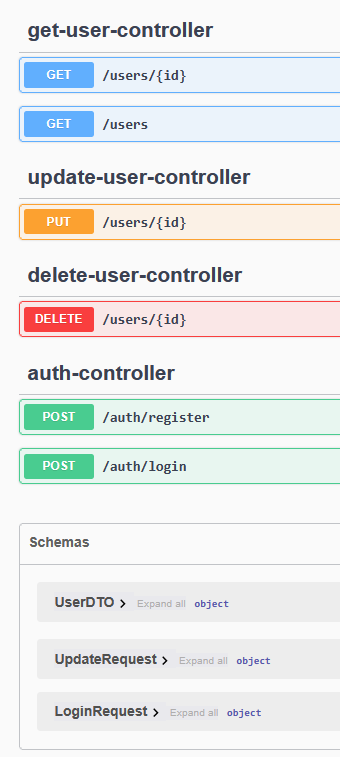
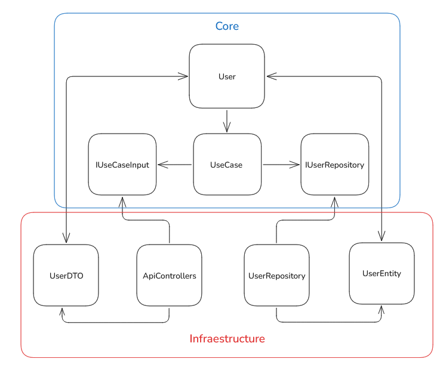

# 👤 User Management API

API REST para registro, login y gestión de usuarios con roles y seguridad JWT.

## 🔐 Funcionalidades
- Registro de usuario (`/auth/register`)
- Login y obtención de JWT (`/auth/login`)
- Roles de usuario: ADMIN y USER
- Gestión de usuarios:
  - Obtener todos los usuarios (`/users`) (ADMIN)
  - Obtener usuario por ID (`/users/{id}`) (ADMIN, USER propio)
  - Actualizar usuario (`/users/{id}`) (ADMIN, USER propio)
  - Eliminar usuario (`/users/{id}`) (ADMIN)

Puedes ver los endpoints y probarlos en la documentación Swagger en la url `http://localhost:8080/swagger-ui/index.html`:



## 📚 Pruevas Realizadas
- [Documentación de la API](docs/API_testing.md)

## 🛡️ Seguridad
- Spring Security + JWT
- Cifrado de contraseñas con BCrypt
- Control de roles: ADMIN y USER

## 🚀 Tecnologías
- Java 17
- Spring Boot
- Spring Security
- JWT
- JPA + PostgreSQL
- Swagger (documentación de la API)

## Configuración de la base de datos

1. Ejecuta el contenedor de PostgreSQL con Docker:

```bash
docker run --name postgres-db -e POSTGRES_USER=gcrel -e POSTGRES_PASSWORD=Pruevas_JV -p 5432:5432 -d postgres
```
2. Accede al contenedor:

```bash
docker exec -it postgres-db psql -U gcrel
```

3. Crea la base de datos:

```sql
CREATE DATABASE user_management;
```

## ▶️ Cómo correr

```bash
./mvnw clean install # Compila el proyecto y descarga dependencias
./mvnw spring-boot:run -pl adapter
```

## 🧱 Arquitectura del Proyecto

Este proyecto sigue los principios de la **Arquitectura Limpia (Clean Architecture)**. La estructura se divide claramente en dos capas principales:

### 🔵 Core
Contiene la lógica de negocio y las abstracciones del sistema. Esta capa es independiente de cualquier tecnología externa.

- **User**: Entidad principal del dominio.
- **UseCase**: Contiene los casos de uso que encapsulan la lógica de negocio.
- **IUserRepository / IUseCaseInput**: Interfaces que definen contratos para la interacción con otras capas.

### 🔴 Infraestructura
Implementa las interfaces definidas en el núcleo y maneja detalles como almacenamiento, entrada/salida, y transporte.

- **UserRepository**: Implementación concreta del repositorio de usuarios.
- **ApiControllers**: Encargados de manejar las peticiones HTTP.
- **UserEntity / UserDTO**: Representaciones para la base de datos y transferencia de datos.

### 📐 Diagrama de Arquitectura

A continuación se muestra el diagrama que representa esta separación basada en Clean Architecture:


